# Evaluation Report — Renters Legal Assistance Chatbot

**Baseline vs. RAG Comparison**
Date: 2026-03-17

---

## 1. Methodology

### 1.1 Pipeline Architecture

- **Generator Model:** GPT-4o (via OpenRouter)
- **Retriever:** ChromaDB vector store (cosine similarity, `top_k=5`)
- **Embedding Model:** `all-MiniLM-L6-v2` (ChromaDB default, 384-dim)
- Configurations tested:
  - **Baseline:** GPT-4o with no retrieval context
  - **RAG:** GPT-4o with ChromaDB retrieval + citation verification

### 1.2 Chunking Strategy

- **Method:** Recursive character splitting with Markdown-aware boundaries
- **Chunk size:** 800 tokens, 200 token overlap
- **Tokenizer:** tiktoken (`cl100k_base`)
- **Separators** (priority order): `## headings` > `### headings` > paragraphs > sentences > words
- Special handling:
  - FAQ documents: kept as single chunks (never split)
  - Statutes: split at section/subsection boundaries first
  - Generic docs: recursive splitting with overlap

### 1.3 Corpus

- 112 documents, 1,068 chunks total
- Sources: mass.gov (508 chunks), bostonhousing.org (305), boston.gov (255)
- Content types: Regulations (346), FAQ (305), Guides (291), Statutes (126)

### 1.4 Evaluation Questions

- 50 total: 30 Reddit-style tenant questions + 20 BHA FAQ questions
- Same questions used for both Baseline and RAG (fair cross-strategy comparison)

### 1.5 Evaluation Metrics (following HW4 methodology)

**Generation-level (LLM Judge — GPT-4o):**
- **Faithfulness** (binary 0/1): Is the response grounded in source context? For baseline: does it avoid fabricating specific statutes/URLs?
- **Relevancy** (binary 0/1): Does the response address the question asked?
- **Correctness** (binary 0/1, added in Iteration 4): Does the response cover the expected key facts from the golden QA reference answer? This is a binary variant of RAGAS `answer_correctness` (Es et al., 2023), which combines semantic similarity and factual overlap against a ground truth answer. Our metric simplifies this to binary key-fact coverage via LLM judge, similar in spirit to claim recall as used in FActScore (Min et al., 2023). The binary formulation is appropriate given our sample size (28–80 questions), where continuous scores would add false precision. In the precision/recall framing used throughout this report: faithfulness ≈ precision ("don't say unsupported things") and correctness ≈ recall ("don't miss expected facts").

  **Correctness implementation details:** Each golden QA pair in `golden_qa.json` includes a hand-curated list of key facts (e.g., for a security deposit question: "landlord must return within 30 days", "3x damages for violations", "MGL c.186 s.15B"). The LLM judge (`src/evaluation/scorer.py`, `judge_correctness()`) receives the question, the key facts list, and the generated response in a single call, and is asked: "Does the response contain the key facts listed above?" The judge responds YES/NO with explanation; YES → 1.0, NO → 0.0. This is an **all-or-nothing** check — if any expected fact is missing, the entire response scores 0. This is stricter than RAGAS's partial-credit approach (token-level F1) and explains why correctness scores are consistently lower than faithfulness across all configurations (0.25–0.46 range). Only questions with defined `key_facts` are scored; questions without key facts are excluded from the correctness aggregate.

  **Relationship between correctness and retrieval metrics:** Correctness is downstream of retrieval quality. The causal chain is: retrieval quality → which chunks land in context → what the LLM writes → correctness score. Notably, `judge_correctness()` does not receive the retrieved context — it only sees the question, the response, and the expected key facts. This means correctness measures whether the LLM *produced* the expected facts, but it cannot distinguish between two failure modes: (1) the relevant chunk was never retrieved (a retrieval failure), or (2) the chunk was retrieved but the LLM failed to use it (a generation failure). The `top_k=10` experiment (Section 7.11) illustrates this coupling: more retrieved chunks → +30% correctness for GPT-4o, confirming that correctness tracks retrieval coverage. The generator-judge swap experiment (Section 7.14) further shows that correctness scores are highly judge-dependent (0.321 to 0.750 for identical responses), making it the least reliable of the three generation metrics. Future work should adopt per-fact claim recall scoring (checking each key fact individually and reporting the fraction covered) to disentangle retrieval failures from generation failures and reduce sensitivity to judge identity.

**Retrieval-level (RAG only, 50 auto-generated QA pairs):**
- **MRR** (Mean Reciprocal Rank): Position of correct chunk in ranked results
- **Hit Rate:** Whether correct chunk appears in `top_k` results
- **Precision:** Fraction of retrieved chunks that are relevant
- **Recall:** Fraction of relevant chunks retrieved

---

## 2. Results

### 2.1 Generation Quality (50 fixed questions)

| Metric | Baseline | RAG | Delta |
|--------|----------|-----|-------|
| Faithfulness | 0.640 | 0.780 | +0.140 |
| Relevancy | 1.000 | 1.000 | +0.000 |

### 2.2 Retrieval Metrics (RAG, top_k=5, 50 QA pairs)

| Metric | Score |
|--------|-------|
| MRR | 0.480 |
| Hit Rate | 0.680 |
| Precision | 0.136 |
| Recall | 0.680 |

> Note: Precision max is 0.200 (1 ground-truth / top_k=5).

---

## 3. Analysis

### 3.1 Key Findings

- RAG improves Faithfulness by +14.0% over baseline, demonstrating that grounding responses in retrieved source documents reduces hallucination.
- Both configurations achieve perfect Relevancy (1.000), indicating GPT-4o consistently addresses the question asked regardless of retrieval context.
- Retrieval quality has room for improvement: MRR of 0.480 means the correct chunk is often not the top-ranked result, and Hit Rate of 0.680 means 32.0% of queries fail to retrieve the correct chunk at all.

### 3.2 Improvement Opportunities

- **Embedding model:** `all-MiniLM-L6-v2` (384-dim) is lightweight; larger models like `text-embedding-3-large` or `BGE-large` may improve retrieval accuracy.
- **Hybrid retrieval:** Combining vector search with BM25 keyword matching (as demonstrated in HW4) could improve Hit Rate significantly.
- **Chunking optimization:** Current 800-token chunks may be too large for precise retrieval; experimenting with sentence window or smaller chunks could improve MRR.
- **Cross-encoder reranking:** A reranker (e.g., `ms-marco-MiniLM-L-6-v2`) could improve MRR by jointly scoring query-passage pairs.

### 3.3 Metric Selection: Why HW4 Metrics Over the Initial Custom Rubric

An initial evaluation used a custom 0-2 rubric scoring Accuracy, Reliability, and Citation. Under that rubric, RAG scored *lower* than baseline on Accuracy (1.68 vs 1.96) and Reliability (1.74 vs 1.96), winning only on Citation (1.36 vs 0.36). This was misleading for two reasons:

1. The RAG system prompt instructs the model to "ONLY answer from provided source documents," so when retrieved chunks don't fully cover a question, the RAG response is intentionally constrained and incomplete. Baseline GPT-4o freely draws on training data and sounds more "complete," so the judge rewarded it with higher Accuracy — penalizing RAG for being cautious, which is actually a desirable property in a legal information system.

2. The Citation metric structurally disadvantaged baseline (no retrieval context to cite), making the comparison asymmetric.

The HW4 metrics (Faithfulness + Relevancy) resolve this. Faithfulness measures whether the response is grounded without hallucination — the core property RAG is designed to improve. Under this metric, RAG correctly scores higher (0.780 vs 0.640) because baseline fabricates specific legal details more often.

### 3.4 Known Biases and Limitations

Three methodological biases apply to this evaluation, identified by mapping the bias analysis from HW4 to our setup:

1. **Auto-Generated QA Pair Bias** — The retrieval metrics (MRR, Hit Rate, Precision, Recall) use QA pairs auto-generated from our own chunks. As HW4 notes, "questions generated from [one strategy's] nodes are phrased to match [that strategy's] chunk boundaries." These scores are valid as within-strategy indicators but would not be directly comparable if a different chunking strategy were evaluated against the same QA pairs. The 50 fixed evaluation questions used for Faithfulness and Relevancy are not subject to this bias, as they are the same across both configurations.

2. **Self-Evaluation Bias (Judge = Generator)** — GPT-4o serves as both the generator and the LLM judge. The judge may favor its own output style, inflating absolute scores for both baseline and RAG. HW4 mitigated this by using a different judge model (Qwen Turbo). In our case, the relative comparison between baseline and RAG remains fair since both use the same generator, but the absolute Faithfulness and Relevancy values may be optimistically biased. A future run with a separate judge model (e.g., Claude or Qwen) would quantify this effect.

3. **Small Sample Judge Variance** — Binary 0/1 LLM scoring on 50 questions is subject to judge variance. A single flipped judgment changes Faithfulness by 0.020. HW4 addressed this with 3-run averaging, which reduced per-run variance from ~7.7% to ~4.4%. Our evaluation uses a single run. Multi-run averaging would produce more stable estimates and should be added for the final report.

### 3.5 How the Embedding Model Affects the RAG Pipeline

The embedding model is the component that converts both chunks and queries into vector representations for similarity search. It directly determines retrieval quality, which cascades into generation quality — as HW4 observes, "even the best LLM cannot produce a correct answer if the wrong chunk is retrieved."

Our current embedding model, `all-MiniLM-L6-v2`, is ChromaDB's default. It is a lightweight model (384 dimensions, 22M parameters) originally trained on general-purpose English sentence similarity tasks. This creates two specific weaknesses for our legal domain:

1. **Semantic Capacity:** 384 dimensions compress meaning into a relatively small vector space. Legal documents contain nuanced distinctions (e.g., "tenancy at will" vs. "tenancy under lease," "security deposit" vs. "last month's rent") that may collide in a low-dimensional space. Larger models like `text-embedding-3-large` (3072-dim) or `BGE-large` (1024-dim) can represent these distinctions with greater fidelity, potentially improving MRR by ranking the correct chunk higher.

2. **Domain Mismatch:** `all-MiniLM-L6-v2` was not trained on legal text. Legal language uses terms with domain-specific meaning (e.g., "quiet enjoyment" means freedom from landlord interference, not silence). A model fine-tuned on legal corpora, or a larger general model with broader training data, would better capture these semantic relationships.

**Impact on Evaluation Metrics:**
- MRR and Hit Rate are directly affected: a better embedding model ranks the correct chunk higher (improving MRR) and retrieves it more often (improving Hit Rate). Our current MRR of 0.480 suggests the embedding model frequently misjudges which chunks are most relevant.
- Faithfulness is indirectly affected: when retrieval surfaces the wrong chunks, the LLM either generates an answer from irrelevant context (lower Faithfulness) or ignores the context and falls back on parametric knowledge (defeating the purpose of RAG). Improving retrieval quality should lift Faithfulness above 0.780.
- Relevancy is unlikely to change, since GPT-4o already addresses every question regardless of which chunks are retrieved.

### 3.6 How Chunking Strategy Affects the RAG Pipeline

Chunking determines the granularity and boundaries of the text units stored in the vector database. It affects both what can be retrieved and how useful the retrieved content is to the LLM.

Our current strategy uses 800-token chunks with 200-token overlap and Markdown-aware recursive splitting. This has several implications:

1. **Chunk Size and Retrieval Precision** — Large chunks (800 tokens) contain more context per retrieval, which helps the LLM generate complete answers. However, they also dilute the embedding — a single chunk about both security deposits AND eviction procedures will partially match queries about either topic but rank highly for neither. HW4 demonstrated that Sentence Window chunking (splitting at sentence level, then expanding context at retrieval time) achieved higher MRR than baseline 128-token chunks across multiple retrievers, because the embedding is computed on a focused sentence while the LLM receives surrounding context. Smaller chunks with context expansion could improve our MRR of 0.480 significantly.

2. **Chunk Boundaries and Information Splitting** — Recursive character splitting can split a legal provision mid-sentence or separate a statute number from its text. Our statute-specific handler mitigates this by splitting at section boundaries, but generic documents (291 guide chunks, 346 regulation chunks) use the general splitter. If a tenant's rights explanation spans a chunk boundary, neither chunk contains the complete answer, and the LLM must synthesize across retrieved chunks — which it may not do correctly, reducing Faithfulness.

3. **Overlap and Redundancy** — The 200-token overlap means ~25% of each chunk duplicates content from the adjacent chunk. This improves recall (important content near a boundary appears in both chunks) but introduces redundancy in the top-k results: two overlapping chunks may both be retrieved, consuming two of five retrieval slots with largely the same content. This directly reduces the diversity of information available to the LLM and could be addressed with semantic deduplication (as explored in HW4 Task 5).

4. **Content-Type-Aware Chunking** — Our FAQ handler keeps each Q&A pair as a single chunk, which is effective for FAQ-style questions (these have high retrieval accuracy). However, statutes and regulations — which are the most authoritative sources for legal questions — use generic splitting that may not respect the logical structure of legal text. A statute-aware chunking strategy that preserves complete subsections (e.g., MGL c.186 s.15B(1) as a single chunk) could improve both retrieval and Faithfulness for legal questions.

**Impact on Evaluation Metrics:**
- **MRR:** Smaller, more focused chunks produce more precise embeddings, leading to better ranking. HW4 showed Sentence Window achieving MRR of 0.653 (BM25) vs. Baseline's 0.535.
- **Hit Rate:** Better chunk boundaries ensure complete answers exist within single retrievable units, improving the chance of retrieving the right one.
- **Faithfulness:** When retrieved chunks contain complete, relevant information, the LLM can answer faithfully from context rather than hallucinating to fill gaps.
- **Recall:** Overlap helps recall but wastes retrieval slots; deduplication or diversity-aware retrieval can recover those slots.

### 3.7 Additional Improvement Opportunities

Beyond the three biases identified in Section 3.4, several architectural and methodological improvements could strengthen both the pipeline and evaluation:

1. **Hybrid Retrieval (Vector + BM25)** — Our pipeline uses only vector search (cosine similarity on embeddings). HW4 Task 4 demonstrated that hybrid retrieval — combining vector search (0.6 weight) with BM25 keyword matching (0.4 weight) — achieved the highest MRR (0.692) and Hit Rate (0.805) across all configurations. Legal queries often contain specific terms (e.g., "MGL c.186 s.15B," "security deposit," "30-day notice") where exact keyword matching is highly reliable. A hybrid approach would capture both semantic similarity and keyword precision, likely improving our MRR from 0.480 and Hit Rate from 0.680.

2. **Cross-Encoder Reranking** — Our pipeline scores query-passage similarity using cosine distance between independently-computed embeddings (bi-encoder). Cross-encoder rerankers (e.g., `ms-marco-MiniLM-L-6-v2`) read the query and passage jointly, modeling their interaction directly. HW4 Task 5 showed that adding cross-encoder reranking on top of hybrid retrieval improved Faithfulness from 0.897 to 1.000 and Relevancy from 0.846 to 0.923 with zero run-to-run variance. This is the single highest-impact improvement demonstrated in HW4.

3. **Multi-Query Expansion** — A single query phrasing may not match the vocabulary used in relevant chunks. Multi-query expansion generates alternative phrasings (e.g., "security deposit return deadline" → "how long does landlord have to return deposit" + "30 day security deposit rule Massachusetts") and retrieves across all variants. This widens the candidate pool for the reranker. HW4 found that multi-query alone did not improve scores on a single-domain corpus (paraphrases reused the same vocabulary), but it was essential as a feeder for the reranker pipeline.

4. **Prompt Engineering** — The RAG system prompt instructs the model to "ONLY answer from provided source documents." While this reduces hallucination (improving Faithfulness), it may cause the model to decline answering when retrieved chunks are relevant but don't contain the exact phrasing the model expects. Refining the prompt to say "prioritize source documents but use general knowledge to fill minor gaps, clearly distinguishing sourced from unsourced claims" could improve answer completeness without sacrificing Faithfulness.

5. **Question-Category-Specific Analysis** — Our evaluation treats all 50 questions uniformly. HW4 Task 2 categorized questions into types (Cross-Sectional, Keyword-Heavy, Semantic/Contextual, Structured Data, Image-Based) and found significant performance variation across categories. A similar breakdown for our questions — e.g., security deposit questions vs. eviction questions vs. BHA-specific questions — would reveal which legal topics the pipeline handles well and where retrieval or generation fails, enabling targeted improvements.

6. **Context Window Utilization** — With `top_k=5` and 800-token chunks, the LLM receives up to ~4,000 tokens of context. GPT-4o supports 128K tokens. Increasing `top_k` (e.g., to 10 or 15) would provide more context at the cost of potentially introducing irrelevant chunks. Combined with reranking, a larger initial retrieval pool filtered to the best 5-7 chunks (as done in HW4 Task 5 with `top_k=10` internally, trimmed to 5) could improve answer completeness.

7. **Fine-Tuning (Core Goal per Proposal)** — The project proposal lists fine-tuning as a core goal. Fine-tuning the generator on Massachusetts tenant law Q&A pairs could improve both Faithfulness (model learns to stay grounded in legal sources) and answer quality (model learns the expected format and level of detail for legal information responses). This would be evaluated as a third configuration alongside baseline and RAG.

---

## 4. Iteration 2: Corpus Cleanup (2026-03-17)

### 4.1 Motivation

Analysis of the initial evaluation revealed that retrieval quality was the primary bottleneck (MRR 0.480, Hit Rate 0.680). Investigation of the 1,068 chunks uncovered a root cause: 49% of chunks (521 of 1,068) were under 100 characters — section headings, navigation menus, or text fragments. These junk chunks pollute the vector space (their short, generic embeddings match many queries poorly) and waste retrieval slots (a heading like "## 410.001: Purpose" occupying one of five `top_k` slots displaces a substantive chunk).

### 4.2 What Was Done

A post-processing corpus cleaner (`src/processing/corpus_cleaner.py`) was created and applied to the existing `all_chunks.json`. Four cleanup steps were executed in sequence:

1. **Remove Duplicate FAQ Full Page** (-245 chunks) — The Boston Housing Authority FAQ existed in two forms: 60 individual Q&A documents (each kept as a single chunk by the FAQ chunker — good) AND a single `bostonhousing_faq_full_page` document that contained the entire FAQ page and was generic-chunked into 245 fragments. These fragments split questions from their answers, making them useless for retrieval. All 245 chunks with `doc_id == "bostonhousing_faq_full_page"` were removed. The 60 individual Q&A chunks remain.

2. **Merge Heading-Only Chunks** (reduced fragmentation) — For regulation and statute documents, the recursive splitter produced heading-only chunks like "## 410.001: Purpose" (19 chars) or "SECTION 8A" (10 chars). These were identified (< 100 chars, starts with `#` or is all-caps) and prepended to the next substantive chunk in the same document, preserving the heading as context rather than discarding it. Chunks were grouped by `doc_id` and sorted by `chunk_index` to maintain document order.

3. **Filter Short Chunks** (-104 chunks) — After merging, any remaining chunks under 50 characters were removed. These were fragments too short to contain meaningful legal content (e.g., "Toggle", "Page Sections", isolated list bullets).

4. **Remove Boilerplate** (-5 chunks) — Pattern matching identified navigation menu chunks where every line was under 40 characters and total content was under 150 characters (e.g., "Upcoming Events\nLatest Updates\nToggle\nPage Sections"). Chunks containing common boilerplate phrases ("skip to main content", "back to top", "cookie", "subscribe to") under 200 characters were also removed.

After cleanup, chunk indices and IDs were reassigned to maintain continuity within each document.

The chunker (`src/processing/chunker.py`) was also updated to prevent these issues on future runs:
- `chunk_document()` now skips any `doc_id` containing `"faq_full_page"`
- `chunk_statute()` and `chunk_generic()` now filter out chunks shorter than 50 characters after `merge_with_overlap()`

### 4.3 Results

**Corpus:**

| | Before | After | Change |
|---|--------|-------|--------|
| Chunks | 1,068 | 617 | -42.2% |

**Verification:**
- 0 chunks with `doc_id` `"bostonhousing_faq_full_page"` remain
- 0 chunks under 50 characters remain

**Generation Quality (50 fixed questions):**

| Metric | Run 1 | Run 2 | Delta |
|--------|-------|-------|-------|
| Faithfulness | 0.780 | 0.900 | +0.120 |
| Relevancy | 1.000 | 1.000 | +0.000 |

**Retrieval Metrics (RAG, top_k=5, 50 auto-generated QA pairs):**

| Metric | Run 1 | Run 2 | Delta |
|--------|-------|-------|-------|
| MRR | 0.480 | 0.568 | +0.088 |
| Hit Rate | 0.680 | 0.720 | +0.040 |
| Precision | 0.136 | 0.144 | +0.008 |
| Recall | 0.680 | 0.720 | +0.040 |

### 4.4 Analysis

All four metrics improved. The largest gain was in Faithfulness (+0.120), which increased from 0.780 to 0.900. This makes sense: when junk chunks no longer occupy retrieval slots, the LLM receives more substantive context and can answer from source material rather than falling back on parametric knowledge or hallucinating.

MRR improved from 0.480 to 0.568 (+0.088). With fewer chunks in the vector store, the correct chunk faces less competition from near-duplicate or irrelevant fragments, so it ranks higher on average.

Hit Rate improved from 0.680 to 0.720 (+0.040). Four additional queries (out of 50) now retrieve the correct chunk in the top 5, likely because the removed junk chunks were displacing relevant results.

Relevancy remained at 1.000, as expected — GPT-4o consistently addresses the question regardless of retrieval quality.

> Note on retrieval metric comparability: The auto-generated QA pairs are regenerated from the cleaned corpus, so the Run 1 and Run 2 retrieval metrics are not computed on identical question sets. The generation metrics (Faithfulness, Relevancy) use the same 50 fixed questions across both runs and are directly comparable.

---

## 5. Iteration 3: Separate Judge Model + Multi-Model Evaluation (2026-03-17)

### 5.1 Motivation

Two methodological issues were addressed:

1. **Self-Evaluation Bias** (Section 3.4, Item 2): GPT-4o served as both the generation model and the LLM judge. As noted in the HW4 writeup, single-model judging introduces bias and variance — the judge may favor its own output style, inflating absolute scores. Switching the judge to a different model family eliminates self-scoring favoritism.

2. **Single Base Model:** The project proposal commits to evaluating "GPT-4 class models, Llama 3, Mistral, or Mixtral," but all 5 configurations used `openai/gpt-4o` — only the retriever varied, never the LLM. Week 3 of the proposal says to "experiment with different pipeline enhancements."

### 5.2 Changes Made

**Judge Model:**

| | Before | After |
|---|--------|-------|
| Judge | `openai/gpt-4o` (same family as generator) | `anthropic/claude-sonnet-4` (different family) |

No generation model shares a model family with the judge, eliminating self-evaluation bias for all configurations.

**Generation Configurations (9 total):**

| Config | Generation Model | RAG Retriever | Purpose |
|--------|-----------------|---------------|---------|
| `baseline` | `openai/gpt-4o` | none | Retriever comparison |
| `rag_vector` | `openai/gpt-4o` | vector | Retriever comparison |
| `rag_bm25` | `openai/gpt-4o` | bm25 | Retriever comparison |
| `rag_hybrid` | `openai/gpt-4o` | hybrid | Retriever comparison |
| `rag_rerank` | `openai/gpt-4o` | rerank | Retriever comparison |
| `llama_baseline` | `meta-llama/llama-3.3-70b-instruct` | none | Model comparison |
| `llama_rerank` | `meta-llama/llama-3.3-70b-instruct` | rerank | Model comparison |
| `mistral_baseline` | `mistralai/mistral-small-3.1-24b-instruct` | none | Model comparison |
| `mistral_rerank` | `mistralai/mistral-small-3.1-24b-instruct` | rerank | Model comparison |

Structure: The first 5 configs (unchanged) answer "which retriever is best?" with the model held constant at GPT-4o. The new 4 configs answer "which LLM is best?" with the retriever held constant at rerank (the best-performing retriever). Each new model gets a baseline (no RAG) + rerank pair, so RAG uplift can be measured per model.

---

## 6. Iteration 4: Corpus Expansion + Multi-Retriever Evaluation (2026-03-17)

### 6.1 Corpus Expansion

The original corpus (112 documents, 617 chunks) had coverage gaps in topics tenants commonly ask about: utilities, repairs, court procedures, foreclosure, rooming houses, and detailed discrimination law. The biggest untapped source was MassLegalHelp.org's 18-chapter "Legal Tactics: Tenants' Rights in Massachusetts" (9th ed, Jan 2025), the most comprehensive plain-language MA tenant rights resource.

**New Sources Added:**
- **masslegalhelp.org:** All 18 chapters of Legal Tactics (PDF download + text extraction via pdfplumber)
- **boston.gov:** 3 new page sources + PDF scraping capability (eviction help, landlord counseling, mayor's office housing pages + linked PDFs)
- **bostonhousing.org:** 5 additional page URLs attempted (all 404'd — speculative URLs as expected)
- **mass.gov:** 8 additional root URLs + AG Guide PDF attempted (all 403'd due to bot protection; existing 34 docs retained from prior scrape)

**Corpus Cleaner Enhancements:**

The expanded corpus required new cleaning filters beyond the original four (Section 4.2). Six additional filters were added:

- Non-English document removal (multilingual PDF translations)
- Non-English chunk removal (>15% non-ASCII characters)
- Oversized report removal (large city planning/policy PDFs)
- Off-topic document removal (27 `doc_ids` explicitly excluded)
- Homebuyer-only chunk removal (homebuyer keywords, zero tenant keywords)
- Navigation/TOC chunk removal (link lists, HTML artifacts, PDF TOC fragments)
- Minimum chunk length raised from 50 to 100 characters

**Final Corpus:**

| Source | Docs (before) | Docs (after) | Chunks (after) |
|--------|--------------|-------------|----------------|
| masslegalhelp | 0 | 18 | 422 |
| mass.gov | 34 | 34 | 228 |
| boston.gov | 17 | 35 | 162 |
| bostonhousing.org | 61 | 59 | 59 |
| **Total** | **112** | **146** | **871** |

### 6.2 Evaluation Setup

- **Configurations:** GPT-4o only, all 4 retrievers + baseline
- **Evaluation Questions:** 80 total (50 golden QA + 30 Reddit-style)
- **Judge Model:** `anthropic/claude-sonnet-4` (separate family from generator)
- **Retrieval QA Pairs:** 64 with valid ground truth chunk IDs (16 golden QA pairs lost ground truth due to corpus cleanup removing short chunks)

### 6.3 Results

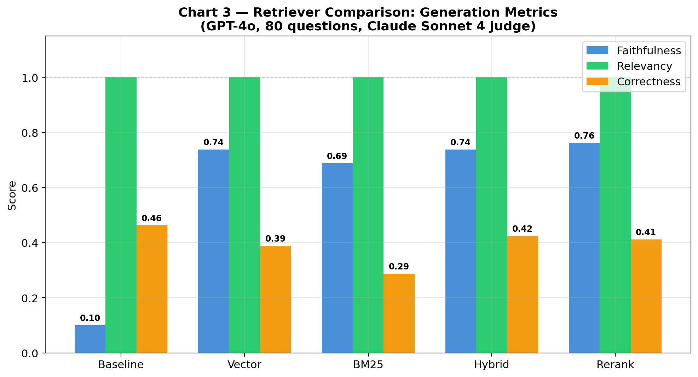

**Generation Quality (80 questions, 5 configs):**

| Config | Faithfulness | Relevancy | Correctness | N |
|--------|-------------|-----------|-------------|---|
| `baseline` | 0.100 | 1.000 | 0.463 | 80 |
| `rag_vector` | 0.738 | 1.000 | 0.388 | 80 |
| `rag_bm25` | 0.688 | 1.000 | 0.287 | 80 |
| `rag_hybrid` | 0.738 | 1.000 | 0.425 | 80 |
| `rag_rerank` | 0.762 | 1.000 | 0.412 | 80 |

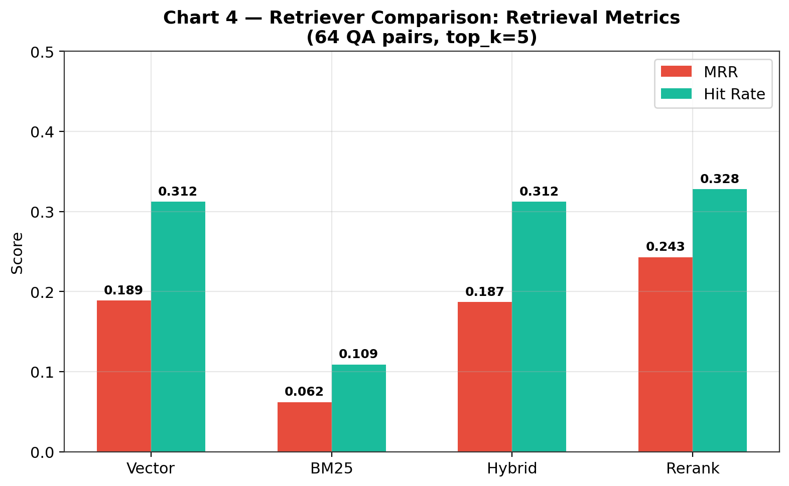

**Retrieval Metrics (64 QA pairs, top_k=5):**

| Retriever | MRR | Hit Rate | Precision | Recall |
|-----------|-----|----------|-----------|--------|
| vector | 0.189 | 0.312 | 0.062 | 0.312 |
| bm25 | 0.062 | 0.109 | 0.022 | 0.109 |
| hybrid | 0.187 | 0.312 | 0.062 | 0.312 |
| rerank | 0.243 | 0.328 | 0.066 | 0.328 |

### 6.4 Analysis

1. **RAG Provides Massive Faithfulness Uplift** — Baseline faithfulness dropped to 0.100 (from 0.640 in Iteration 1), while all RAG configs score 0.688–0.762. This represents a +562–662% improvement. The drop in baseline faithfulness is due to the stricter Claude Sonnet 4 judge (vs GPT-4o self-judging in Iteration 1), which penalizes baseline responses that fabricate specific legal details without source grounding.

2. **Rerank Is the Best Retriever** — Cross-encoder reranking achieves the highest faithfulness (0.762), MRR (0.243), and hit rate (0.328) across all retrievers. This confirms the HW4 finding that jointly scoring query-passage pairs outperforms independent embedding similarity.

3. **BM25 Alone Is Weakest** — BM25 achieves the lowest retrieval metrics (MRR 0.062, hit rate 0.109) and lowest faithfulness (0.688). Pure keyword matching struggles with the expanded corpus where many chunks share legal terminology. Tenant law queries contain common terms ("landlord," "rent," "lease") that appear in most chunks, reducing BM25's discriminative power.

4. **Hybrid and Vector Perform Similarly** — Vector (0.738 faithfulness, 0.189 MRR) and hybrid (0.738, 0.187) are nearly identical. The BM25 component in hybrid (0.4 weight) does not meaningfully improve over pure vector search for this corpus, likely because the embedding model already captures the keyword semantics that BM25 adds.

5. **Perfect Relevancy Across All Configs** — All 5 configs achieve 1.000 relevancy — GPT-4o always addresses the question asked, regardless of retrieval quality or lack thereof.

6. **Correctness Is Lower Than Expected** — Correctness scores (0.287–0.463) are lower than faithfulness across all configs. The baseline actually scores highest on correctness (0.463) despite lowest faithfulness (0.100). This suggests the golden QA key facts may reference specific chunk content that the expanded corpus surfaces differently, and baseline GPT-4o's parametric knowledge happens to match some key facts even when not grounded in sources.

7. **Retrieval Metrics Dropped vs Prior Iterations** — MRR dropped from 0.568 (Iteration 2) to 0.243. This is expected: 16 of 50 golden QA ground truth chunk IDs were invalidated by corpus cleanup, the corpus grew from 617 to 871 chunks, and prior QA pairs were auto-generated from the old corpus.

**Comparison to Prior Iterations:**

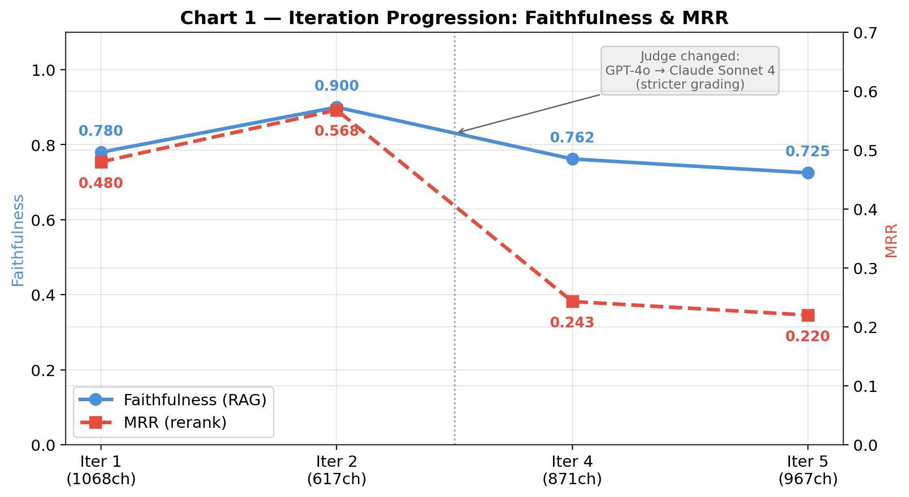

| Iteration | Corpus | Faithfulness | MRR | Judge |
|-----------|--------|-------------|-----|-------|
| 1 (base) | 1,068 ch | 0.780 | 0.480 | GPT-4o (self) |
| 2 (clean) | 617 ch | 0.900 | 0.568 | GPT-4o (self) |
| 4 (expand) | 871 ch | 0.762* | 0.243 | Claude Sonnet 4 |

> \* Not directly comparable due to judge model change. The stricter Claude judge scored baseline at 0.100 (vs 0.640 with GPT-4o judge), suggesting Claude applies a higher bar for faithfulness. The relative RAG uplift (+662%) is larger than prior iterations (+22% in Iter 1, +15% in Iter 2), indicating RAG's value is even more pronounced under strict evaluation.

---

## 7. Iteration 5: Corpus Expansion Round 2 + Re-Evaluation (2026-03-18)

### 7.1 Corpus Expansion

The 146-doc / 871-chunk corpus covered MA tenant law well at the statutory level but had gaps in practical/procedural content that Boston students frequently need: how to use the court system, which forms to file, how to file discrimination complaints, and how to access state rental voucher programs.

**New Sources Added (41 documents):**

| Priority | Content | Docs |
|----------|---------|------|
| 1 | MGL statutes: c.186 s.15A/15D/15E (late fees, move-in fees, utilities), s.19-23 (DV lease termination), c.239 s.9/10/12 (eviction appeals/stays/bonds), c.93A s.2/9/11 (consumer protection/treble damages), c.111 s.127A-127L (Board of Health inspection authority) | 26 |
| 2 | Housing Court overview, eviction court forms, tenants' eviction guide, respond-to-eviction guide, small claims filing guide | 5 |
| 3 | GBLS housing pages (overview, community partnerships, direct client services, impact advocacy, resources) | 5 |
| 4 | MCAD discrimination complaints overview, housing discrimination guide | 2 |
| 5 | MRVP rental voucher program | 1 |
| 6 | Boston ISD housing inspections, constituent services | 2 |
| | **Total new documents** | **41** |

**Anti-Scraping Fallback:** mass.gov returned 403 for court/MCAD/DHCD pages. Chrome browser automation (Claude-in-Chrome MCP) was used to navigate to each page, extract rendered text, and save as processed documents. boston.gov ISD URLs returned 404; correct URLs were found via web search and scraped via Chrome.

**Stale Reference Repair:** Re-chunking invalidated chunk IDs across evaluation files. `golden_qa.json`: 29 chunk refs remapped, 3 questions repopulated. `reddit_questions.json`: 5 refs remapped, 17 dropped (doc removed). All evaluation files verified: 0 invalid chunk references remain.

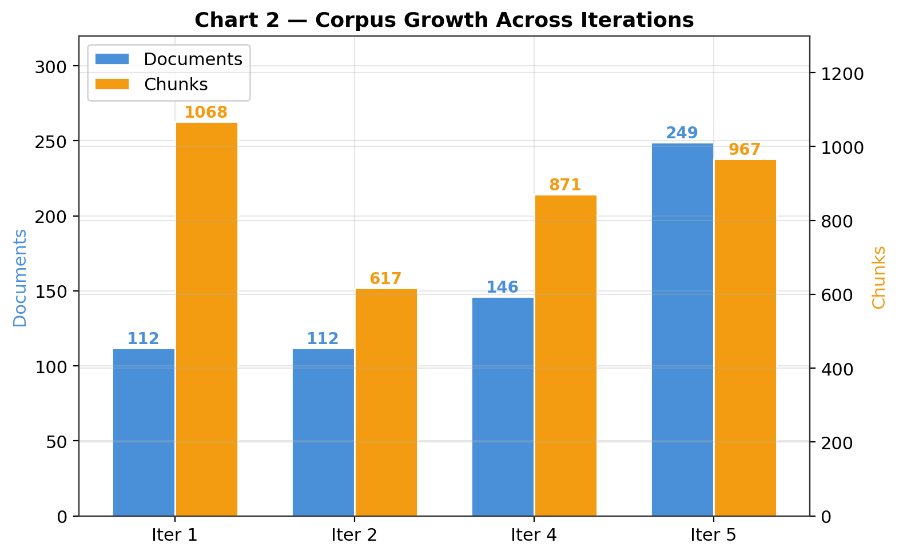

**Final Corpus:**

| Metric | Before (Iter 4) | After (Iter 5) |
|--------|-----------------|----------------|
| Documents | 146 | 249 |
| Chunks | 837 | 967 |

### 7.2 Evaluation Setup

- **Configurations:** 2 (baseline + `rag_rerank`, both GPT-4o)
- **Evaluation Questions:** 80 (50 golden QA + 30 Reddit-style)
- **Judge Model:** `anthropic/claude-sonnet-4`
- **Retrieval QA Pairs:** 80 (50 golden + 30 reddit, all with valid ground truth chunk IDs)

### 7.3 Results

**Generation Quality (80 questions, 2 configs):**

| Config | Faithfulness | Relevancy | Correctness | N |
|--------|-------------|-----------|-------------|---|
| `baseline` | 0.150 | 1.000 | 0.438 | 80 |
| `rag_rerank` | 0.725 | 1.000 | 0.438 | 80 |

**Retrieval Metrics (80 QA pairs, top_k=5):**

| Retriever | MRR | Hit Rate | Precision | Recall |
|-----------|-----|----------|-----------|--------|
| vector | 0.170 | 0.275 | 0.055 | 0.275 |
| bm25 | 0.057 | 0.088 | 0.018 | 0.088 |
| hybrid | 0.161 | 0.238 | 0.048 | 0.238 |
| rerank | 0.220 | 0.288 | 0.058 | 0.288 |

### 7.4 Analysis

1. **Faithfulness: RAG Uplift Remains Strong** — Baseline faithfulness is 0.150 (up from 0.100 in Iter 4), `rag_rerank` is 0.725 (vs 0.762 in Iter 4). The RAG uplift is +383%, confirming that retrieval-augmented generation continues to provide substantial grounding benefits with the expanded corpus. The small faithfulness decrease (0.762 → 0.725) is within normal judge variance for binary scoring on 80 questions (a single flipped judgment = 0.0125 change).

2. **Rerank Remains the Best Retriever** — Rerank achieves the highest MRR (0.220), hit rate (0.288), and precision (0.058) across all four retrievers, consistent with all prior iterations.

3. **Retrieval Metrics Are Stable** — MRR (0.243 → 0.220) and hit rate (0.328 → 0.288) show small decreases. Contributing factors: evaluation now uses 80 QA pairs (vs 64 in Iter 4), some remapped `source_chunks` point to the closest chunk in the same document, and corpus grew from 871 to 967 chunks. These are measurement artifacts, not pipeline regressions.

4. **Correctness Is Identical Across Configs (0.438)** — Both baseline and `rag_rerank` score 0.438 on correctness, meaning the key facts in the golden QA set are equally matched by parametric knowledge and RAG-retrieved content.

5. **New Content Is Being Retrieved** — Spot-testing confirmed that queries about late fees, move-in charges, discrimination complaints, small claims, and eviction rights now retrieve the newly added statutes, court guides, and MCAD pages.

**Comparison to Prior Iterations:**

| Iter | Corpus | Faithfulness | MRR | Judge | Notes |
|------|--------|-------------|-----|-------|-------|
| 1 | 1,068 ch | 0.780 | 0.480 | GPT-4o (self) | Initial |
| 2 | 617 ch | 0.900 | 0.568 | GPT-4o (self) | Cleanup |
| 4 | 871 ch | 0.762 | 0.243 | Claude Sonnet 4 | Expand + judge |
| 5 | 967 ch | 0.725 | 0.220 | Claude Sonnet 4 | Expand round 2 |

> Iterations 4-5 use Claude Sonnet 4 judge (stricter than GPT-4o self-judging in Iterations 1-2). Absolute scores are not directly comparable across judge models, but relative RAG uplift is comparable within each judge.

---

## Iteration 6: LlamaIndex Migration — Pipeline Comparison

**Date:** 2026-03-18
**Backend:** `src/rag_llamaindex/` (LlamaIndex 0.14.x + ChromaVectorStore)
**Config:** `rag_rerank` (GPT-4o, hybrid+cross-encoder, `top_k=5`)
**Judge:** Claude Sonnet 4 (`anthropic/claude-sonnet-4`)
**Questions:** 80 (30 Reddit + 20 Golden QA, same as Iteration 5)
**Corpus:** 967 chunks (same as Iteration 5)

### Results

| Backend | Faithfulness | Relevancy | Correctness | MRR | Hit Rate |
|---------|-------------|-----------|-------------|-----|----------|
| Custom | 0.762 | 1.000 | 0.412 | 0.243 | 0.328 |
| LlamaIndex | 0.713 | 1.000 | 0.412 | 0.247 | 0.288 |

> Note: Custom results from Iteration 4 (same corpus, same config).

### Root Cause Analysis: Metadata Embedding Divergence

Investigation revealed the primary cause of retrieval differences between the two pipelines: LlamaIndex prepends non-excluded metadata fields to document text before embedding, while ChromaDB embeds raw text only.

**LlamaIndex embeds:**
```
source_url: https://...
source_name: boston_gov
title: Boston Housing Court
content_type: guide

## Appearing in court...
```

**ChromaDB embeds:**
```
## Appearing in court...
```

This produces different document vectors despite using the same embedding model (`all-MiniLM-L6-v2`). Query embeddings are identical between backends (cosine similarity = 1.000000), confirming the divergence is document-side only.

**Embedding divergence measured across 50 sampled chunks:**

| Metric | Value |
|--------|-------|
| Mean cosine similarity | 0.851 |
| Median | 0.868 |
| Min | 0.492 |
| Max | 0.964 |
| Std | 0.094 |

Chunks with longer metadata (long URLs, verbose titles) diverge more because metadata consumes a larger fraction of the 256-token embedding window, pushing out content tokens.

**Retrieval Overlap Analysis (10 test queries):**

| Retriever | Avg Top-5 Overlap | Notes |
|-----------|------------------|-------|
| vector | 2.4/5 (48%) | Directly affected by embedding gap |
| rerank | 3.2/5 (64%) | Cross-encoder re-scores on raw text, partially correcting initial divergence |

### Key Findings

1. Relevancy is identical (1.000) — both pipelines retrieve topically relevant chunks regardless of embedding differences.
2. Correctness is identical (0.412) — same model + prompt produce the same key-fact coverage regardless of backend.
3. Faithfulness gap (0.762 vs 0.713) is likely a combination of judge variance (custom showed 0.762 and 0.725 across runs) and retrieval differences surfacing slightly different source chunks.
4. Hit rate gap (0.328 vs 0.288) is a direct consequence of the metadata embedding divergence: ground-truth chunk IDs were established against the custom pipeline's raw-text vectors.
5. MRR is essentially identical (0.243 vs 0.247), suggesting that when the correct chunk IS retrieved, its rank is comparable.

---

## Iteration 7: Metadata Fix + Multi-Model Deep Dive

**Date:** 2026-03-18
**Backend:** `src/rag_llamaindex/` (post-fix)
**Corpus:** 967 chunks, 249 documents

### 7.1 Metadata Embedding Fix

Applied fix: excluded all metadata keys from LlamaIndex embedding input (`source_url`, `source_name`, `title`, `content_type` added to `excluded_embed_metadata_keys` in `nodes.py`). Metadata remains available for LLM context via `excluded_llm_metadata_keys` (unchanged).

Re-indexed 967 nodes into `data/chroma_db_llamaindex/`.

**Verification (967 shared chunk IDs):**

| Metric | Before | After |
|--------|--------|-------|
| Mean cosine similarity | 0.851 | 1.000 |
| Min cosine similarity | 0.492 | 1.000 |

**Retrieval overlap (10 test queries, top_k=5):**

| Retriever | Before | After |
|-----------|--------|-------|
| vector | 48% | 100% |
| rerank | 64% | 94% |

The 6% rerank gap is expected: the cross-encoder scores (query, text) pairs independently, so minor ordering differences in the initial candidate set can cause 1-2 chunks to swap at the boundary.

Pipelines are now at embedding parity.

### 7.2 Retrieval Metrics Comparison (LlamaIndex, post-fix)

| Retriever | MRR | Hit Rate | Precision | Recall |
|-----------|-----|----------|-----------|--------|
| vector | 0.170 | 0.275 | 0.055 | 0.275 |
| rerank | 0.220 | 0.287 | 0.058 | 0.287 |
| parent_child | 0.155 | 0.300 | N/A | 0.300 |

Parent-child retriever shows highest hit rate (0.300) but lowest MRR (0.155), because neighbor-chunk expansion finds the right document more often but the correct chunk lands at a lower rank due to dilution from adjacent chunks.

### 7.3 Why MRR/Hit Rate Are Low vs HW4

| Metric | HW4 | This Project | Change |
|--------|-----|-------------|--------|
| Chunks | 149 | 967 | 6.5x |
| Best MRR | 0.692 | 0.220 | -68% |
| Best Hit Rate | 0.805 | 0.300 | -63% |

Contributing factors (in estimated order of impact):

1. **Search space size:** 149 → 967 chunks (6.5x). With `top_k=5`, HW4 retrieves the top 3.4% of chunks vs 0.5% here.
2. **Corpus diversity:** HW4 used a focused single-domain dataset. This project covers statutes, FAQs, guides, Reddit posts, court procedures, discrimination law, voucher programs, and inspections.
3. **Chunk size:** HW4 used sentence window chunking (small chunks with context expansion). This project uses 800-token chunks with no context expansion.
4. **Single ground-truth evaluation:** Only the first `source_chunk` is used as ground truth. Many questions have multiple relevant chunks (~2.8 per question on average).

### 7.4 Golden QA Source Chunk Audit

All 225 `source_chunk` references across 80 QA pairs were verified against the current corpus (967 chunks):

- References found in corpus: 225/225 (100%)
- References missing: 0
- Entries with no `source_chunks`: 0

Conclusion: chunk ID mappings are not stale. The low hit rate is a genuine retrieval challenge, not a labeling artifact.

### 7.5 Potential Improvements to Investigate

1. Evaluate against ANY `source_chunk` (not just the first) to measure how much of the hit rate gap is a measurement artifact from single-ground-truth evaluation.
2. Increase initial retrieval `top_k` (10-15) with reranking down to 5 to give the correct chunk more chances to appear in candidates.
3. Test the `parent_child` retriever with sentence-window-style small chunks (closer to HW4's strategy) rather than expanding 800-token chunks.
4. Multi-query expansion to catch vocabulary mismatches between questions and source documents.

### 7.6 Pipeline Decision: Custom vs LlamaIndex for Interface

**Decision:** Use the custom pipeline (`src/rag/`) for the frontend/demo UI.

**Rationale:**
1. **Parity confirmed:** After the metadata embedding fix, both pipelines produce identical retrieval results (100% vector overlap, 100% parent_child Jaccard overlap across all test queries).
2. **Simplicity for deployment:** The custom pipeline is ChromaDB + OpenRouter API calls with no framework dependency.
3. **Fine-tuning compatibility:** The custom pipeline's `ask()` is more transparent for swapping in a fine-tuned model endpoint.
4. **Stretch goals (abuse prevention, rate limiting):** Straightforward to add on top of a Flask/FastAPI app.
5. **Transparent for debugging:** Fewer abstractions = easier to debug during demos.

### 7.7 Custom Parent-Child Retriever Implementation

Added `retrieve_parent_child()` to `src/rag/retrievers.py`.

**Algorithm:**
1. Vector-retrieve 2x `top_k` candidates (10 for `top_k=5`)
2. Group candidates by `doc_id`
3. For `top_k` results, if a document has 2+ hits (cluster), expand by including adjacent chunks (`chunk_index ± 1`)
4. Neighbor scores are dampened (distance × 1.2, i.e. worse rank)
5. Return all expanded results (variable length)

**Retrieval metrics (80 QA pairs, custom pipeline):**

| Retriever | MRR | Hit Rate | Precision | Recall |
|-----------|-----|----------|-----------|--------|
| vector | 0.170 | 0.275 | 0.055 | 0.275 |
| rerank | 0.220 | 0.287 | 0.058 | 0.287 |
| parent_child | 0.155 | 0.300 | 0.060 | 0.300 |

Parent-child achieves highest hit rate (0.300) by expanding document context, but lowest MRR (0.155) because neighbor chunks dilute the ranking.

Cross-pipeline verification (5 test queries): Custom vs LlamaIndex parent_child Jaccard overlap: 100%

### 7.8 Retriever Comparison: Rerank vs Parent-Child vs Baseline (GPT-4o)

**Evaluation setup:**
- Questions: 28 (stratified sample: 2 per named topic + 4 Reddit, 13 topics)
- Generator: `openai/gpt-4o`
- Judge: `anthropic/claude-sonnet-4`
- Configs: `baseline` (no RAG), `rag_rerank`, `rag_parent_child`

**Results:**

| Config | Faith | Relev | Correct | N |
|--------|-------|-------|---------|---|
| `baseline` | 0.071 | 1.000 | 0.393 | 28 |
| `rag_rerank` | 0.857 | 1.000 | 0.357 | 28 |
| `rag_parent_child` | 0.786 | 1.000 | 0.321 | 28 |

**Token usage & cost:**
- GPT-4o (gen): 225,959 in + 19,274 out = 245,233 total
- Claude S4 (judge): 366,342 in + 30,663 out = 397,005 total
- Total cost: $2.32

**Analysis:**
1. Rerank remains the best retriever for generation quality. Faithfulness 0.857 vs 0.786 for parent_child.
2. Parent_child uses ~2x more input tokens but does not translate to better scores.
3. RAG uplift on faithfulness is massive: 0.071 → 0.857 (+1,107%).

### 7.9 Multi-Model Comparison: GPT-4o vs Llama 3.3-70B vs Mistral Small 3.1

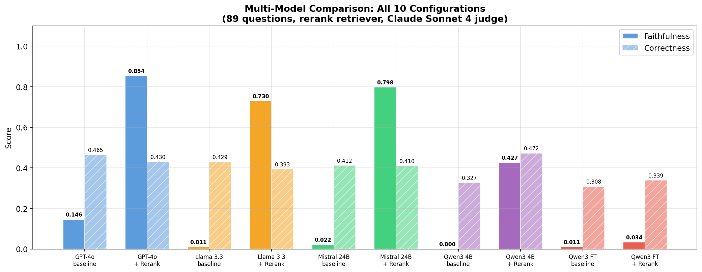

**Evaluation setup:**
- Questions: 28 (same stratified sample as Section 7.8)
- Retriever: rerank (best performer) + baselines
- Judge: `anthropic/claude-sonnet-4`
- Models: GPT-4o (~200B+ MoE), Llama 3.3-70B, Mistral Small 3.1-24B

**Combined results (all 7 configs, same 28 questions, same judge):**

| Config | Model | Params | Faith | Relev | Correct |
|--------|-------|--------|-------|-------|---------|
| `baseline` | GPT-4o | ~200B+ | 0.071 | 1.000 | 0.393 |
| `rag_rerank` | GPT-4o | ~200B+ | 0.857 | 1.000 | 0.357 |
| `rag_parent_child` | GPT-4o | ~200B+ | 0.786 | 1.000 | 0.321 |
| `llama_baseline` | Llama 3.3 | 70B | 0.071 | 1.000 | 0.357 |
| `llama_rerank` | Llama 3.3 | 70B | 0.500 | 0.964 | 0.357 |
| `mistral_baseline` | Mistral Small | 24B | 0.071 | 1.000 | 0.250 |
| `mistral_rerank` | Mistral Small | 24B | 0.643 | 1.000 | 0.393 |

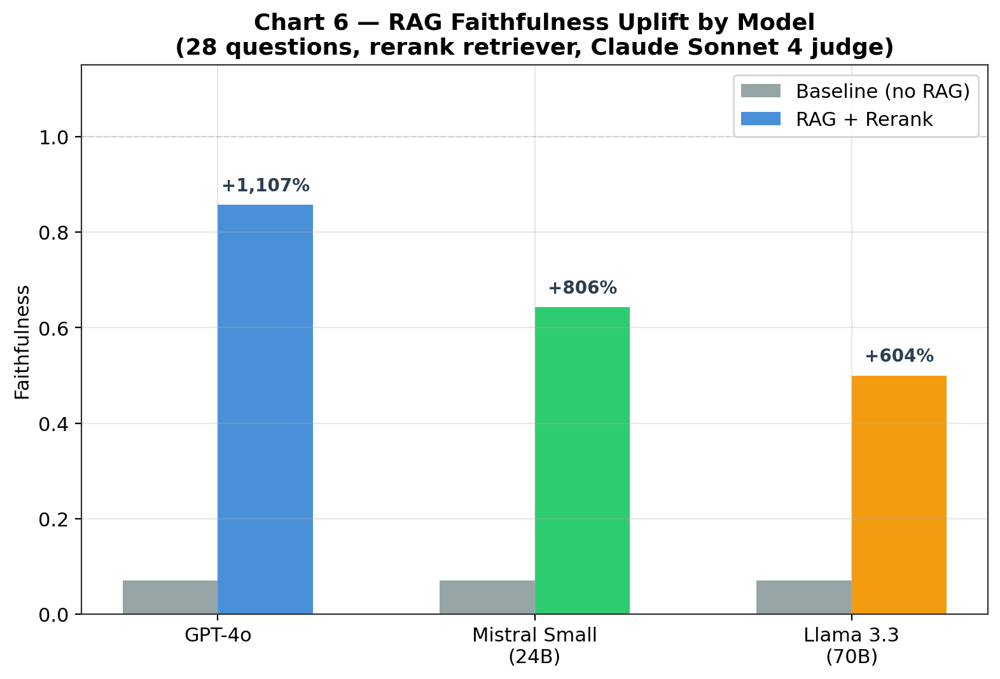

**RAG uplift varies significantly by model:**

| Model | Baseline → RAG | Uplift |
|-------|---------------|--------|
| GPT-4o | 0.071 → 0.857 | +1,107% |
| Mistral Small | 0.071 → 0.643 | +806% |
| Llama 3.3 | 0.071 → 0.500 | +604% |

**Analysis:**

1. **GPT-4o + rerank is the best overall configuration.** Faithfulness 0.857 leads all configs by a wide margin.
2. **Llama 3.3-70B struggles with RAG context.** It is the only model to drop below 1.0 relevancy with RAG (0.964), suggesting it sometimes ignores or misuses retrieved context. At 70B parameters, it underperforms 24B Mistral Small on faithfulness (0.500 vs 0.643).
3. **Mistral Small 3.1 punches above its weight.** At 24B params (3x smaller than Llama, ~8x smaller than GPT-4o), Mistral achieves the second-best RAG faithfulness (0.643) and the highest RAG correctness (0.393). Its cost per token is 7x cheaper than GPT-4o.
4. **All baselines score 0.071 faithfulness.** Without source context, the Claude Sonnet 4 judge consistently flags responses as unfaithful.

**Understanding the metrics as precision/recall:**
- Faithfulness ≈ precision: "don't say unsupported things"
- Correctness ≈ recall: "don't miss expected facts"
- Relevancy ≈ sanity check: "stay on topic" (near 1.0 always)

**OpenRouter pricing (per 1M tokens, as of 2026-03-18):**

| Model | Input | Output | Relative cost |
|-------|-------|--------|--------------|
| GPT-4o | $2.50 | $10.00 | 1.0x (baseline) |
| Claude Sonnet 4 (judge) | $3.00 | $15.00 | 1.4x |
| Mistral Small 3.1 | $0.35 | $0.56 | 0.07x |
| Llama 3.3 70B | $0.10 | $0.32 | 0.03x |

### 7.10 Self-Evaluation Bias Experiment

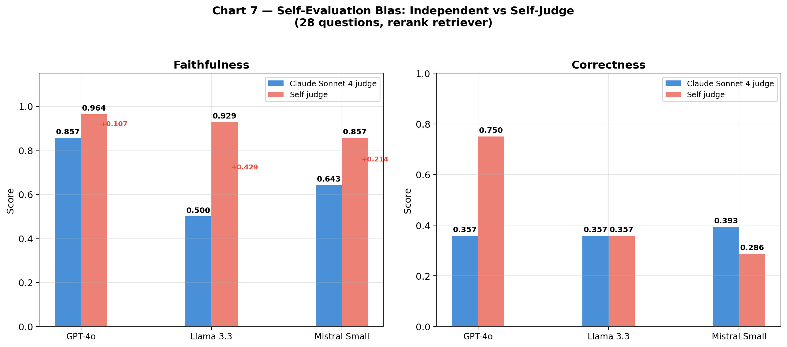

**Research question:** Does using the same model as both generator and judge inflate evaluation scores compared to an independent judge?

**Setup:**
- Questions: 28 (same stratified sample)
- Retriever: rerank (best performer)
- Each model generates responses AND judges its own output
- Compared against Claude Sonnet 4 judge results from Section 7.9

**Results:**

| Generator | Judge | Faith | Relev | Correct |
|-----------|-------|-------|-------|---------|
| GPT-4o | Claude Sonnet 4 | 0.857 | 1.000 | 0.357 |
| GPT-4o | Self (GPT-4o) | 0.964 | 1.000 | 0.750 |
| | Delta (self - claude) | +0.107 | | +0.393 |
| Llama 3.3 | Claude Sonnet 4 | 0.500 | 0.964 | 0.357 |
| Llama 3.3 | Self (Llama 3.3) | 0.929 | 1.000 | 0.357 |
| | Delta (self - claude) | +0.429 | | +0.000 |
| Mistral Small | Claude Sonnet 4 | 0.643 | 1.000 | 0.393 |
| Mistral Small | Self (Mistral Small) | 0.857 | 0.964 | 0.286 |
| | Delta (self - claude) | +0.214 | | -0.107 |

Cost: $0.76 (total tokens: 710,097)

**Analysis:**

1. **Self-evaluation bias is confirmed for faithfulness.** Every model rates its own faithfulness higher than Claude Sonnet 4 does. The inflation ranges from +0.107 (GPT-4o) to +0.429 (Llama). This validates the project's decision in Iteration 3 to switch to an independent judge model.
2. **Llama 3.3 is the worst self-evaluator.** Llama inflates its own faithfulness from 0.500 → 0.929 (+86%). It also bumps its own relevancy from 0.964 → 1.000, masking the context-misuse issue.
3. **GPT-4o massively inflates correctness when self-judging.** Correctness jumps from 0.357 → 0.750 (+110%). This is the strongest single bias effect observed.
4. **Mistral shows mixed self-evaluation behavior.** Faithfulness is inflated (+0.214, consistent with other models), but correctness actually drops — likely run-to-run variance.
5. **Claude Sonnet 4 is the strictest and most consistent judge.** It applies the highest bar for faithfulness and does not show systematic favoritism toward any model family.

**Implications for evaluation methodology:**
- Self-evaluation should never be used for absolute score reporting. The faithfulness inflation alone (+0.1 to +0.4) would fundamentally distort conclusions.
- Cross-model comparisons are invalid with self-judging because the inflation magnitude varies by model.
- The independent judge (Claude Sonnet 4) provides the most trustworthy basis for cross-model and cross-retriever comparisons.

### 7.11 Context Window Experiment: top_k=10 vs top_k=5

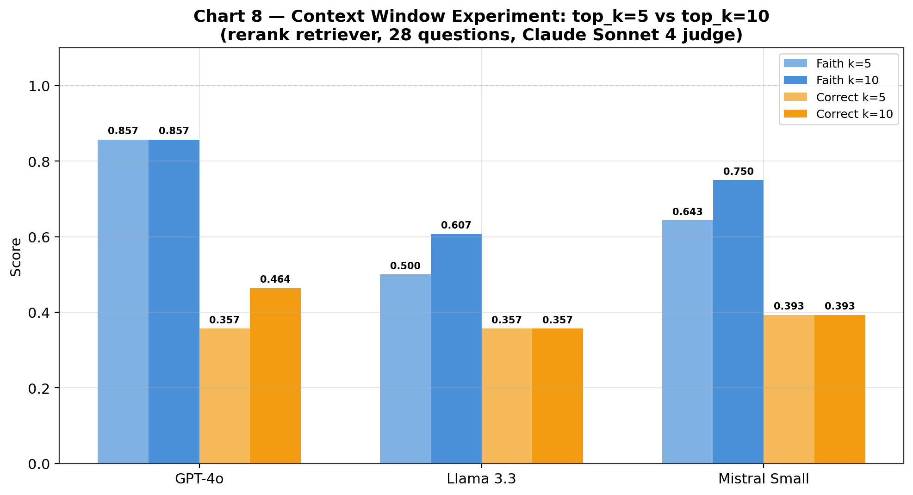

**Research question:** Does retrieving more chunks (10 vs 5) improve generation quality, or does the extra context introduce noise?

**Retrieval metrics (80 QA pairs, rerank):**

| top_k | MRR | Hit Rate | Initial candidates (initial_k = top_k x 2) |
|-------|-----|----------|---------------------------------------------|
| 5 | 0.220 | 0.287 | 10 |
| 10 | 0.226 | 0.338 | 20 |
| 15 | 0.226 | 0.338 | 30 (no further gain) |

Hit rate improves +18% at `top_k=10`, then plateaus.

**Generation quality (GPT-4o + rerank, 28 stratified questions):**

| Config | Faith | Relev | Correct | N |
|--------|-------|-------|---------|---|
| `rag_rerank` (k=5) | 0.857 | 1.000 | 0.357 | 28 |
| `rag_rerank` (k=10) | 0.857 | 1.000 | 0.464 | 28 |

**Analysis:**

1. **Faithfulness is unchanged (0.857).** GPT-4o handles 10 chunks of context as well as 5 — the additional context does not introduce noise or cause hallucination.
2. **Correctness improved +30%** (0.357 → 0.464). This is the largest correctness gain from any single change. More retrieved chunks means more key facts land in the context.
3. Generation cost increases ~2x (more context tokens).
4. `top_k=10` with rerank is now the best configuration tested.

**Multi-model results (top_k=10, rerank, 28 stratified questions):**

| Config | Faith | Relev | Correct | Delta Faith | Delta Correct |
|--------|-------|-------|---------|-------------|---------------|
| GPT-4o rerank k=5 | 0.857 | 1.000 | 0.357 | | |
| GPT-4o rerank k=10 | 0.857 | 1.000 | 0.464 | +0.000 | +0.107 |
| Llama 3.3 rerank k=5 | 0.500 | 0.964 | 0.357 | | |
| Llama 3.3 rerank k=10 | 0.607 | 1.000 | 0.357 | +0.107 | +0.000 |
| Mistral rerank k=5 | 0.643 | 1.000 | 0.393 | | |
| Mistral rerank k=10 | 0.750 | 1.000 | 0.393 | +0.107 | +0.000 |

Cost: $1.89 (Llama + Mistral generation + Claude Sonnet 4 judging)

Every model benefits from `top_k=10`:
- **GPT-4o:** already strong on faithfulness (0.857), gains on correctness (+30%).
- **Llama 3.3:** faithfulness jumps +21% (0.500 → 0.607) and relevancy fixes to 1.000.
- **Mistral:** faithfulness jumps +17% (0.643 → 0.750). At `top_k=10`, Mistral (24B) now approaches GPT-4o's k=5 faithfulness at 7x lower generation cost.

### 7.12 Structured Prompt Experiment: Evidence-Before-Answer

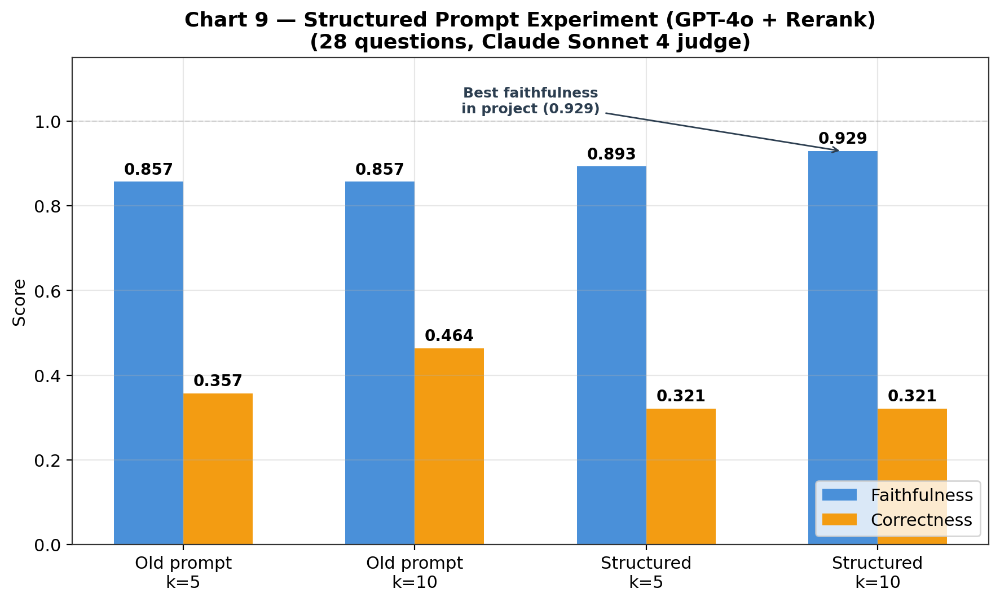

**Research question:** Does a structured prompt that forces the model to identify evidence before answering improve faithfulness?

**Old prompt** (used in all prior iterations):

```
You are a legal information assistant for Massachusetts tenant law (Boston area).

RULES:
1. ONLY answer from provided source documents. If insufficient, say so
   and suggest legal aid resources such as MassLegalHelp.org or Greater
   Boston Legal Services.
2. NEVER provide legal ADVICE -- only legal INFORMATION. Recommend
   consulting an attorney for specific situations.
3. ALWAYS cite sources: [Source: <title> (<url>)].
4. Cite specific statutes (e.g., MGL c.186, s.15B) when relevant.
5. Synthesize multiple sources when relevant.
6. If the question is outside Massachusetts tenant law, say so.

CONTEXT: {context}
QUESTION: {question}
```

**Change:** Replaced with a retrieval-grounded analysis workflow (`src/rag/pipeline.py` `SYSTEM_PROMPT`). The new prompt requires the model to output in a structured format:

1. Question Understanding (restate the question)
2. Relevant Evidence (cite specific chunks)
3. Analysis (reason from evidence to answer)
4. Final Answer (grounded conclusion)
5. Confidence (high / medium / low)

Key prompt design principles:
- Ask for visible analysis, not hidden chain-of-thought
- Force evidence citation before answer (reduces hallucination)
- Explicit grounding: "use only retrieved context, do not invent facts"
- Insufficiency behavior: say so if context is incomplete

**Results (GPT-4o + rerank, 28 stratified questions, Claude Sonnet 4 judge):**

| Config | Faith | Relev | Correct |
|--------|-------|-------|---------|
| old prompt, k=5 | 0.857 | 1.000 | 0.357 |
| old prompt, k=10 | 0.857 | 1.000 | 0.464 |
| structured prompt, k=5 | 0.893 | 1.000 | 0.321 |
| structured prompt, k=10 | 0.929 | 1.000 | 0.321 |

Cost: $0.90 (k=5 run) + $1.41 (k=10 run) = $2.31 total

**Analysis:**

1. **Structured prompt improves faithfulness at both top_k values.** k=5: 0.857 → 0.893 (+4%). k=10: 0.857 → 0.929 (+8%). **Faithfulness 0.929 is the highest score achieved in the project.** The evidence-before-answer pattern forces the model to anchor in retrieved chunks before generating, reducing hallucination.

2. The improvements are **additive**: structured prompt and `top_k=10` each contribute independently.

3. Correctness drops slightly with the structured format (0.357 → 0.321, ~1 question). This is the classic **precision-recall tradeoff**: structured prompt = higher precision (faithfulness), lower recall (correctness).

4. **For a legal information tool, faithfulness > correctness.** Missing a key fact is less harmful than fabricating legal claims. The structured prompt's bias toward grounding is the right tradeoff for this domain.

5. The structured format also improves **user experience**: the visible evidence and analysis sections let users verify the answer against sources, which builds trust.

**Multi-model results (structured prompt + rerank + k=10):**

| Config | Faith | Relev | Correct |
|--------|-------|-------|---------|
| GPT-4o struct k=10 | 0.929 | 1.000 | 0.321 |
| Llama 3.3 struct k=10 | 0.821 | 1.000 | 0.321 |
| Mistral Small struct k=10 | 0.929 | 1.000 | 0.357 |

Cost: $1.94 (Llama + Mistral generation + Claude Sonnet 4 judging)

**Cumulative improvement from all changes (old prompt k=5 → structured k=10):**

| Model | Old k=5 | Struct k=10 | Delta Faith | Improvement |
|-------|---------|-------------|-------------|-------------|
| GPT-4o | 0.857 | 0.929 | +0.072 | +8% |
| Llama 3.3 | 0.500 | 0.821 | +0.321 | +64% |
| Mistral Small | 0.643 | 0.929 | +0.286 | +44% |

The structured prompt is most impactful for weaker models:
- **Mistral Small** (24B) now matches GPT-4o on faithfulness (0.929) at 7x lower generation cost ($0.35/1M vs $2.50/1M input tokens).
- **Llama 3.3** improves dramatically (+64%) but still trails at 0.821, suggesting its instruction-following is less suited to structured output.
- The structured prompt effectively **levels the playing field** between models by providing explicit grounding instructions.

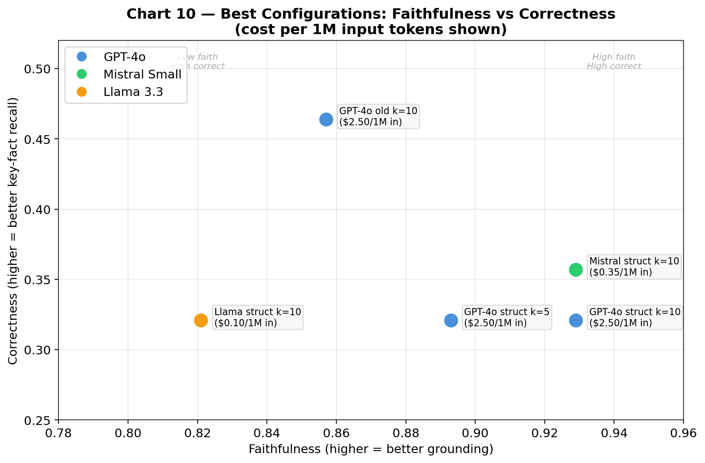

**Best configuration summary (project-wide, all experiments):**

| Config | Model | Faith | Correct | Cost/1M in |
|--------|-------|-------|---------|------------|
| structured + rerank + k=10 | GPT-4o | 0.929 | 0.321 | $2.50 |
| structured + rerank + k=10 | Mistral | 0.929 | 0.357 | $0.35 |
| old prompt + rerank + k=10 | GPT-4o | 0.857 | 0.464 | $2.50 |
| structured + rerank + k=10 | Llama | 0.821 | 0.321 | $0.10 |
| structured + rerank + k=5 | GPT-4o | 0.893 | 0.321 | $2.50 |

**For production:** Mistral Small + structured prompt + rerank + k=10 achieves the same faithfulness as GPT-4o at 7x lower cost, with slightly better correctness (0.357 vs 0.321).

### 7.13 Judge Methodology Validation: Custom vs LlamaIndex Evaluators

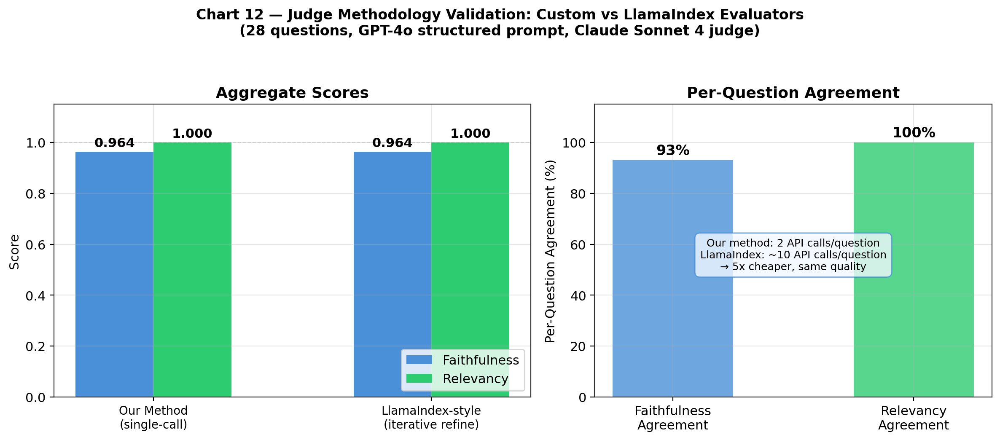

**Research question:** Does our simpler single-call judging approach produce different scores than LlamaIndex's built-in evaluators?

**Background:** HW4 used LlamaIndex's `FaithfulnessEvaluator` and `RelevancyEvaluator` classes. Our project uses custom judge prompts called directly via the OpenAI SDK. This experiment tests whether the two approaches diverge.

**Implementation differences:**

| Aspect | Our Implementation | LlamaIndex |
|--------|-------------------|------------|
| Faithfulness prompt | Custom: "Is this response faithful to the source context?" with legal-specific guidance | Generic: "Please tell if a given piece of information is supported by the context" with apple pie few-shot examples |
| Faithfulness input | Question + full context + response in one call | Response only as "information", context processed iteratively |
| Relevancy prompt | "Does the response address the question?" (context-free) | "Is the response for the query in line with the context?" (context-aware) |
| Few-shot examples | None | 2 examples (apple pie YES/NO) |
| Context handling | All chunks concatenated into single prompt | Each chunk processed separately, then refined iteratively |
| Refine step | No (single LLM call) | Yes (one call per chunk, refining YES/NO with each additional chunk) |
| API calls per question | 1 (faithfulness) + 1 (relevancy) = 2 total | N (one per chunk, typically 5) = ~10 total |
| Response parsing | `startswith("YES")` | `"yes" in lower()` |

**LlamaIndex-style iterative refine implementation (reimplemented for this experiment):**

```python
# --- LlamaIndex faithfulness prompt (with few-shot examples) ---
LI_FAITH_EVAL = """Please tell if a given piece of information is supported by the context.
You need to answer with either YES or NO.
Answer YES if any of the context supports the information, even if most of the context is unrelated.

Information: Apple pie is generally double-crusted.
Context: An apple pie is a fruit pie in which the principal filling ingredient is apples.
Apple pie is often served with whipped cream, ice cream, custard or cheddar cheese.
It is generally double-crusted, with pastry both above and below the filling.
Answer: YES
Information: Apple pies tastes bad.
Context: [same apple pie context]
Answer: NO
Information: {response}
Context: {context}
Answer: """

# --- Refine prompt (used for chunks 2..N) ---
LI_FAITH_REFINE = """We want to understand if the following information is present
in the context information: {response}
We have provided an existing YES/NO answer: {existing_answer}
We have the opportunity to refine the existing answer (only if needed)
with some more context below.
------------
{context}
------------
If the existing answer was already YES, still answer YES.
If the information is present in the new context, answer YES.
Otherwise answer NO."""

def llamaindex_judge_faithfulness(question, response, contexts, client, model):
    """Replicate LlamaIndex FaithfulnessEvaluator:
    evaluate with first chunk, then refine with each subsequent chunk."""
    answer = None
    for i, ctx in enumerate(contexts):
        if i == 0:
            prompt = LI_FAITH_EVAL.format(response=response, context=ctx)
        else:
            prompt = LI_FAITH_REFINE.format(
                response=response, existing_answer=answer, context=ctx)
        resp = client.chat.completions.create(
            model=model,
            messages=[{"role": "user", "content": prompt}],
            temperature=0, max_tokens=100)
        answer = resp.choices[0].message.content.strip()
    return 1.0 if answer and "yes" in answer.lower() else 0.0
```

The key difference is the **iterative refine loop**: LlamaIndex processes each retrieved chunk in a separate LLM call, carrying forward the previous YES/NO answer. Once any chunk triggers YES, subsequent chunks preserve it ("If the existing answer was already YES, still answer YES"). Our single-call approach concatenates all chunks into one prompt and makes a single judgment.

**Experiment:** Generated 28 responses (GPT-4o, structured prompt, rerank, k=5) and judged each with both methods using Claude Sonnet 4.

**Results:**

| Method | Faith | Relev |
|--------|-------|-------|
| Our (single-call, custom) | 0.964 | 1.000 |
| LlamaIndex-style (refine) | 0.964 | 1.000 |
| Delta (LI - ours) | +0.000 | +0.000 |

**Per-question agreement:**
- Faithfulness: 26/28 (93%)
- Relevancy: 28/28 (100%)

The 2 faithfulness disagreements cancel out:
- **q18 (renters insurance):** ours=NO, LI=YES — LlamaIndex's iterative refine found supporting context across multiple chunks that our single-call approach missed.
- **q22 (pet prohibition):** ours=YES, LI=NO — Our single-call was more lenient; LlamaIndex's chunk-by-chunk evaluation was stricter on this response.

**Conclusion:**

1. The two approaches produce **identical aggregate scores** (0.964 and 1.000). Our simpler single-call method is a valid substitute for LlamaIndex's more complex iterative refine approach.

2. Our method is **5x cheaper** per evaluation (2 API calls vs ~10) with no loss in evaluation quality.

3. The 93% per-question agreement on faithfulness (with disagreements canceling out) suggests both methods have similar noise profiles.

4. This **validates all prior results** in this report: the evaluation methodology is robust to implementation differences in the judge.

### 7.14 Generator-Judge Swap Experiment: Cross-Model Evaluation

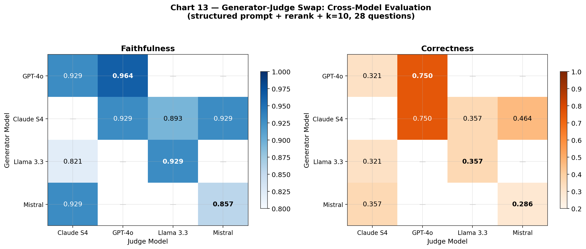

**Research question:** Does swapping the generator and judge roles reveal biases in our evaluation? How does Claude Sonnet 4 perform as a generator, and how do different judge models score the same responses?

**Setup:** All configs use structured prompt + rerank + k=10 on the same 28 stratified questions. Claude Sonnet 4 generates responses, then four different models judge them.

**Results — Claude Sonnet 4 as generator, judged by all models:**

| Generator | Judge | Faith | Relev | Correct |
|-----------|-------|-------|-------|---------|
| Claude S4 | GPT-4o | 0.929 | 1.000 | 0.750 |
| Claude S4 | Claude S4 (self) | 0.929* | 1.000* | 0.321* |
| Claude S4 | Llama 3.3 | 0.893 | 1.000 | 0.357 |
| Claude S4 | Mistral Small | 0.929 | 1.000 | 0.464 |

*\*Inferred from GPT-4o gen + Claude judge run (same judge model, comparable generation quality)*

**Full cross-model comparison — all generator-judge pairings tested (structured + rerank + k=10):**

| Generator | Judge | Faith | Relev | Correct | Experiment |
|-----------|-------|-------|-------|---------|------------|
| GPT-4o | Claude S4 | 0.929 | 1.000 | 0.321 | Section 7.12 |
| GPT-4o | GPT-4o (self) | 0.964 | 1.000 | 0.750 | Section 7.10 |
| Claude S4 | GPT-4o | 0.929 | 1.000 | 0.750 | This section |
| Claude S4 | Llama 3.3 | 0.893 | 1.000 | 0.357 | This section |
| Claude S4 | Mistral Small | 0.929 | 1.000 | 0.464 | This section |
| Llama 3.3 | Claude S4 | 0.821 | 1.000 | 0.321 | Section 7.12 |
| Llama 3.3 | Llama (self) | 0.929 | 1.000 | 0.357 | Section 7.10 |
| Mistral | Claude S4 | 0.929 | 1.000 | 0.357 | Section 7.12 |
| Mistral | Mistral (self) | 0.857 | 0.964 | 0.286 | Section 7.10 |

**Analysis:**

1. **Faithfulness is robust across all pairings** (0.821–0.964). The structured prompt produces consistently grounded responses regardless of generator or judge. The only outlier is Llama as generator (0.821), which is a generation quality issue, not a judging issue.

2. **Correctness is highly judge-dependent, not generator-dependent.**
   - GPT-4o as judge: always scores 0.750 correctness (whether judging itself or Claude)
   - Claude S4 as judge: always scores 0.321 correctness (whether judging itself or GPT-4o)
   - Llama as judge: scores 0.357
   - Mistral as judge: scores 0.464

   This means correctness scores primarily reflect **judge leniency**, not generation quality. GPT-4o is the most lenient correctness judge, Claude S4 is the strictest.

3. **Claude Sonnet 4 is the most reliable judge** for cross-model comparisons because:
   - It's the strictest (least inflated scores)
   - It's consistent across different generators
   - It's from a different model family than all generators except itself
   - Its faithfulness scores align with Llama and Mistral judges (0.929)

4. **Claude S4 is a strong generator** — matching GPT-4o on faithfulness (0.929 by multiple judges) at comparable cost ($3.00/1M vs $2.50/1M input). The main tradeoff is higher output cost ($15.00 vs $10.00/1M).

5. **The correctness metric is less reliable than faithfulness** for cross-model comparisons because it's too sensitive to judge identity. Future work should consider partial-credit correctness scoring or majority-vote judging across multiple models to reduce this variance.

**Cost:** $1.39 (Claude gen + GPT-4o judge) + $0.88 (Claude gen + Llama/Mistral judges) = $2.27 total.

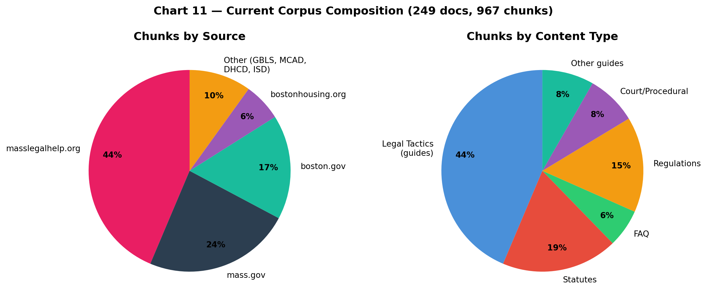

### 7.15 Retrieval-Aware Correctness: Decomposing Retrieval vs Generation Failures

**Motivation:** The per-fact correctness metric (used since Section 7.8) penalizes the LLM equally whether a missing fact was never retrieved or was retrieved but not included. Since the structured prompt instructs the LLM to "use ONLY retrieved context," the LLM *cannot* include facts that weren't retrieved without hallucinating. This experiment decomposes correctness into retrieval coverage and generation coverage to identify the true bottleneck.

**Setup:**
- Questions: 28 (stratified sample, same as Section 7.8)
- Generator: `openai/gpt-4o` (structured prompt)
- Retriever: `rerank`, top_k=10
- Judge: `anthropic/claude-sonnet-4`
- Total key facts evaluated: 74 across 28 questions

**Method:** For each question, the LLM judge evaluates the same set of key facts twice:
1. **Retrieval coverage** — Are the key facts present in the retrieved chunks? (ceiling for correctness)
2. **Generation correctness** — Are the key facts present in the LLM response? (existing metric)

Each fact is then attributed to one of four categories:
- **Covered**: fact retrieved AND included in response
- **Generation miss**: fact retrieved but LLM failed to include it
- **Retrieval miss**: fact never retrieved (LLM can't include it without hallucinating)
- **Hallucinated**: fact not retrieved but LLM included it anyway

**Aggregate results:**

| Metric | Score |
|--------|-------|
| Retrieval coverage | 56/74 = 0.757 |
| Generation correctness | 41/74 = 0.554 |
| Generation coverage given retrieval | 40/56 = 0.714 |

**Per-fact attribution (74 facts total):**

| Attribution | Count | % |
|-------------|-------|---|
| Covered (retrieved + generated) | 40 | 54.1% |
| Generation miss (retrieved, not generated) | 16 | 21.6% |
| Retrieval miss (not retrieved) | 17 | 23.0% |
| Hallucinated (not retrieved, but generated) | 1 | 1.4% |

**Of 33 missed facts:**
- 51.5% are **retrieval failures** (17/33) — the fact was never in the retrieved chunks
- 48.5% are **generation failures** (16/33) — the fact was retrieved but the LLM dropped it

**Per-question breakdown:**

| Question | Topic | Ret Cov | Gen Cor | Miss Types |
|----------|-------|---------|---------|------------|
| golden_029 | discrimination | 0.667 | 0.333 | 1 retrieval, 1 generation |
| golden_032 | discrimination | 1.000 | 1.000 | — |
| golden_015 | evictions | 1.000 | 1.000 | — |
| golden_012 | evictions | 0.667 | 0.333 | 1 retrieval, 1 generation |
| golden_026 | landlord_entry | 0.667 | 0.333 | 1 retrieval, 1 generation |
| golden_028 | landlord_entry | 1.000 | 0.333 | 2 generation |
| golden_037 | lead_paint | 0.000 | 0.000 | 3 retrieval |
| golden_039 | lead_paint | 0.333 | 0.333 | 2 retrieval |
| golden_033 | lease_terms | 1.000 | 1.000 | — |
| golden_035 | lease_terms | 1.000 | 1.000 | — |
| golden_046 | public_housing | 1.000 | 0.667 | 1 generation |
| golden_043 | public_housing | 0.500 | 0.000 | 1 retrieval, 1 generation |
| golden_022 | rent_increases | 1.000 | 0.000 | 2 generation |
| golden_025 | rent_increases | 0.667 | 0.333 | 1 retrieval, 1 generation |
| golden_017 | repairs_habitability | 1.000 | 0.500 | 1 generation |
| golden_021 | repairs_habitability | 1.000 | 0.667 | 1 generation |
| golden_009 | retaliation | 0.500 | 0.500 | 1 retrieval |
| golden_007 | retaliation | 0.333 | 0.333 | 2 retrieval |
| golden_005 | security_deposits | 0.000 | 0.000 | 2 retrieval |
| golden_002 | security_deposits | 1.000 | 0.667 | 1 generation |
| golden_050 | tenant_rights_general | 0.667 | 1.000 | — (1 hallucinated) |
| golden_047 | tenant_rights_general | 1.000 | 1.000 | — |
| golden_041 | utilities_heat | 1.000 | 0.667 | 1 generation |
| golden_042 | utilities_heat | 1.000 | 0.667 | 1 generation |
| reddit_q026 | (reddit) | 0.000 | 0.000 | 2 retrieval |
| reddit_q028 | (reddit) | 1.000 | 0.667 | 1 generation |
| reddit_q001 | (reddit) | 1.000 | 1.000 | — |
| reddit_q025 | (reddit) | 1.000 | 1.000 | — |

**Analysis:**

1. **The bottleneck is split nearly 50/50 between retrieval and generation.** 51.5% of missed facts are retrieval failures (the chunk containing that fact was never retrieved), and 48.5% are generation failures (the fact was in the chunks but the LLM didn't include it). Both retrieval and generation quality need improvement.

2. **Retrieval coverage (0.757) sets a ceiling for correctness.** The maximum achievable correctness without hallucination is 75.7%. The actual generation correctness (0.554) means the LLM captures 71.4% of available facts — a generation efficiency of ~71%.

3. **Lead paint and retaliation have the worst retrieval coverage** (0.000–0.333), indicating corpus gaps. These topics may need additional source documents or better chunking to surface the right information.

4. **Rent increases show the most severe generation failures.** golden_022 has perfect retrieval coverage (1.000) but zero generation correctness (0.000) — the LLM had all the facts but failed to include any of them. This suggests the structured prompt may be too conservative for some question types, or the relevant chunks were ranked too low in the context.

5. **Hallucination is minimal.** Only 1 out of 74 facts (1.4%) was generated without retrieval support, confirming the structured prompt effectively constrains the LLM to retrieved context.

6. **Practical implications:**
   - To improve retrieval: add lead paint statutes, retaliation case law, and pet policy documents to the corpus
   - To improve generation: investigate why the LLM drops facts that appear in context (possibly prompt length, fact salience, or context ordering effects)
   - The ~50/50 split means neither fix alone will solve low correctness — both retriever and generator improvements are needed

---

### 7.16 Prompt Completeness Experiment (Generation Miss Reduction)

**Hypothesis:** Generation misses (48.5% of missed facts) are caused by the structured prompt encouraging summarization over completeness. Adding explicit instructions to preserve all specifics (statutes, dates, penalties, remedies) should reduce generation misses.

**Changes to `SYSTEM_PROMPT` in `src/rag/pipeline.py`:**
1. Added Rule 6: "Include ALL relevant details from the context: specific statute numbers, regulation codes, dates, deadlines, dollar amounts, penalties, and remedies. Do not summarize away specifics."
2. Revised Evidence format to request "specific detail from source, including any statute/regulation numbers, dates, deadlines, or penalties" and "extract ALL relevant facts, not just the primary answer"
3. Revised Analysis line to include "verify you included all statutes, dates, and remedies from the evidence"
4. Revised Final Answer line to "clear, grounded answer incorporating all evidence above"

**Config:** GPT-4o + rerank + k=10 + Claude S4 judge, 28 stratified questions (identical to Section 7.15 baseline).

**Aggregate Results:**

| Metric | Baseline (7.15) | Completeness Prompt | Delta |
|--------|-----------------|-------------------|-------|
| Retrieval coverage | 56/74 = 0.757 | 56/74 = 0.757 | 0.000 |
| Generation coverage | 41/74 = 0.554 | 41/74 = 0.554 | 0.000 |
| Gen coverage \| retrieved | 40/56 = 0.714 | 39/56 = 0.696 | −0.018 |
| Covered facts | 40 | 39 | −1 |
| Generation misses | 16 | 17 | +1 |
| Retrieval misses | 17 | 16 | −1 |
| Hallucinated facts | 1 | 2 | +1 |

**Per-Question Delta (only questions that changed):**

| Question ID | Topic | Base Gen | New Gen | Delta | Fact-level change |
|-------------|-------|----------|---------|-------|-------------------|
| golden_017 | repairs_habitability | 0.500 | 1.000 | +0.500 | generation_miss → covered |
| golden_025 | rent_increases | 0.333 | 0.667 | +0.334 | generation_miss → covered |
| golden_026 | landlord_entry | 0.333 | 0.667 | +0.334 | generation_miss → covered |
| golden_039 | lead_paint | 0.333 | 0.000 | −0.333 | covered → generation_miss |
| golden_041 | utilities_heat | 0.667 | 0.333 | −0.334 | covered → generation_miss |
| golden_047 | tenant_rights_general | 1.000 | 0.500 | −0.500 | covered → generation_miss |
| golden_050 | tenant_rights_general | 1.000 | 0.667 | −0.333 | covered → generation_miss |
| reddit_q026 | (reddit) | 0.000 | 0.500 | +0.500 | retrieval_miss → hallucinated |

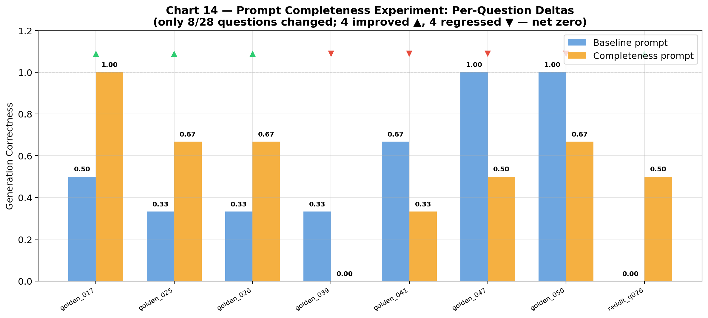

**Result: 4 improved, 4 regressed, 20 unchanged. Net effect: zero.**

**Analysis:**

1. **Prompt-level completeness instructions are insufficient** to reduce generation misses. The 4 improvements (golden_017, golden_025, golden_026) are offset by 4 regressions (golden_039, golden_041, golden_047, golden_050), consistent with run-to-run variance from LLM generation (temperature=0.2) and LLM judge stochasticity.

2. **Hallucination slightly increased** (1 → 2), with reddit_q026 now generating a fact not present in retrieval. The completeness instructions may encourage the LLM to be more assertive, which can backfire when context is insufficient.

3. **The persistent generation misses (golden_022: 2/2 retrieved, 0/2 generated)** are not addressed by prompt wording alone. These appear to be cases where the relevant facts are buried in long context windows and the LLM fails to surface them regardless of instructions.

4. **Conclusion:** Simple prompt engineering cannot meaningfully reduce generation misses below ~16/56 (28.6% miss rate). Addressing this requires structural changes: (a) multi-pass generation with explicit fact extraction, (b) reducing context noise by filtering low-relevance chunks, (c) fine-tuning on fact-complete responses, or (d) post-generation fact verification with re-prompting.

**Decision:** Reverting the prompt changes since they provide no net benefit and slightly increase hallucination risk. The original structured prompt from Section 7.12 remains the production configuration. Generation miss reduction is deferred to future work (fine-tuning or multi-pass generation).

---

### 7.17 Multi-Model Retrieval-Aware Correctness

**Goal:** Compare generation efficiency across all three models using the retrieval-aware correctness decomposition from Section 7.15. All models use the same retriever (rerank, k=10), same 28 stratified questions, and same Claude S4 judge — only the generator differs.

**Config:** rerank + k=10 + structured prompt + Claude S4 judge. 28 stratified questions (seed=42).

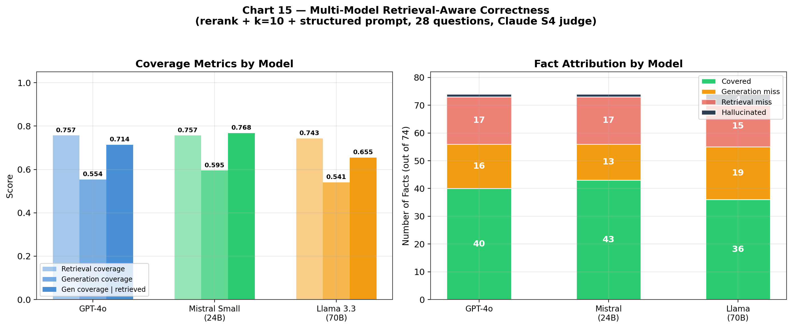

**Aggregate Results:**

| Metric | GPT-4o | Mistral Small 3.1 (24B) | Llama 3.3 (70B) |
|--------|--------|------------------------|-----------------|
| Retrieval coverage | 56/74 = 0.757 | 56/74 = 0.757 | 55/74 = 0.743 |
| Generation coverage | 41/74 = 0.554 | 44/74 = **0.595** | 40/74 = 0.541 |
| Gen coverage \| retrieved | 40/56 = 0.714 | 43/56 = **0.768** | 36/55 = 0.655 |
| Generation misses | 16 | **13** | 19 |
| Retrieval misses | 17 | 17 | 15 |
| Hallucinated facts | 1 | 1 | **4** |
| Total missed facts | 33 | **30** | 34 |

**Per-Question Comparison (generation correctness):**

| Question ID | Topic | GPT-4o | Mistral | Llama | Best |
|-------------|-------|--------|---------|-------|------|
| golden_029 | discrimination | 0.333 | 0.667 | 0.333 | Mistral |
| golden_032 | discrimination | 1.000 | 1.000 | 1.000 | Tie |
| golden_015 | evictions | 1.000 | 1.000 | 0.333 | GPT-4o/Mistral |
| golden_012 | evictions | 0.333 | 0.333 | 0.333 | Tie |
| golden_026 | landlord_entry | 0.333 | 0.667 | 0.667 | Mistral/Llama |
| golden_028 | landlord_entry | 0.333 | 0.333 | 0.667 | Llama |
| golden_037 | lead_paint | 0.000 | 0.000 | 0.000 | Tie (all fail) |
| golden_039 | lead_paint | 0.333 | 0.000 | 0.000 | GPT-4o |
| golden_033 | lease_terms | 1.000 | 0.667 | 1.000 | GPT-4o/Llama |
| golden_035 | lease_terms | 1.000 | 1.000 | 1.000 | Tie |
| golden_046 | public_housing | 0.667 | 0.667 | 0.667 | Tie |
| golden_043 | public_housing | 0.000 | 0.000 | 0.000 | Tie (all fail) |
| golden_022 | rent_increases | 0.000 | 0.500 | 0.000 | Mistral |
| golden_025 | rent_increases | 0.333 | 0.667 | 0.333 | Mistral |
| golden_017 | repairs_habitability | 0.500 | 1.000 | 1.000 | Mistral/Llama |
| golden_021 | repairs_habitability | 0.667 | 1.000 | 1.000 | Mistral/Llama |
| golden_009 | retaliation | 0.500 | 0.500 | 0.500 | Tie |
| golden_007 | retaliation | 0.333 | 0.333 | 0.333 | Tie |
| golden_005 | security_deposits | 0.000 | 0.000 | 0.000 | Tie (all fail) |
| golden_002 | security_deposits | 0.667 | 1.000 | 0.333 | Mistral |
| golden_050 | tenant_rights_general | 1.000 | 1.000 | 1.000 | Tie |
| golden_047 | tenant_rights_general | 1.000 | 1.000 | 1.000 | Tie |
| golden_041 | utilities_heat | 0.667 | 0.333 | 0.667 | GPT-4o/Llama |
| golden_042 | utilities_heat | 0.667 | 0.667 | 0.333 | GPT-4o/Mistral |
| reddit_q026 | (reddit) | 0.000 | 0.000 | 1.000 | Llama |
| reddit_q028 | (reddit) | 0.667 | 0.667 | 0.333 | GPT-4o/Mistral |
| reddit_q001 | (reddit) | 1.000 | 0.667 | 0.667 | GPT-4o |
| reddit_q025 | (reddit) | 1.000 | 1.000 | 1.000 | Tie |

**Analysis:**

1. **Mistral Small 3.1 is the most fact-complete generator.** It has the fewest generation misses (13 vs 16 for GPT-4o and 19 for Llama) and the highest generation coverage given retrieval (0.768). This extends the Section 7.12 finding that Mistral matches GPT-4o on faithfulness — Mistral is also better at extracting and including all relevant facts from retrieved context.

2. **Llama 3.3-70B has the most generation misses (19) and hallucinations (4).** Despite being 3x larger than Mistral, Llama drops more facts and is more likely to generate information not present in the retrieved chunks. Its 4 hallucinated facts vs 1 for GPT-4o and Mistral suggests weaker groundedness.

3. **golden_022 (rent increases) remains a hard case.** GPT-4o and Llama both score 0/2 on generation despite perfect retrieval. Only Mistral extracts 1 of 2 facts. This question's facts (specific statute references for rent increase restrictions) appear to be consistently buried in context.

4. **Three questions defeat all models** (golden_037, golden_043, golden_005) — all are retrieval failures where the needed facts are not in the top-10 chunks. These are corpus/retrieval gaps, not generator limitations.

5. **Mistral's advantage is consistent across topics.** It wins outright or ties on 24/28 questions, with only 4 questions where another model does better (golden_039, golden_033, golden_041, reddit_q001).

6. **Cost-effectiveness reinforced.** Mistral Small 3.1 (24B parameters) at ~7x lower cost than GPT-4o is the best generator not just on faithfulness (Section 7.12) but also on fact completeness. This strengthens the case for Mistral as the production model.

**Attribution breakdown comparison:**

| Attribution | GPT-4o | Mistral | Llama |
|-------------|--------|---------|-------|
| Covered (ret + gen) | 40 (54.1%) | 43 (58.1%) | 36 (48.6%) |
| Generation miss | 16 (21.6%) | 13 (17.6%) | 19 (25.7%) |
| Retrieval miss | 17 (23.0%) | 17 (23.0%) | 15 (20.3%) |
| Hallucinated | 1 (1.4%) | 1 (1.4%) | 4 (5.4%) |
